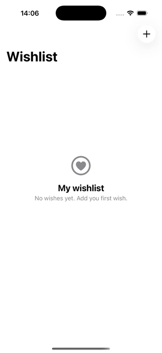

# 🎁 Wishlist

Une app iOS de gestion de liste de souhaits, développée avec SwiftUI et SwiftData.


## 📱 Aperçu

<div align="center">
  
  <p><em>Ajout et suppression de souhaits</em></p>
</div>

## ✨ Fonctionnalités

- ➕ **Ajout de souhaits** — Via une alerte native iOS avec champ de texte
- 🗑️ **Suppression par swipe** — Pattern natif iOS avec `.onDelete`
- 💾 **Persistance automatique** — SwiftData sauvegarde les données sans configuration supplémentaire
- 🫙 **Empty state** — `ContentUnavailableView` quand la liste est vide
- 🔢 **Compteur dynamique** — Affiche le nombre de souhaits avec gestion automatique du singulier/pluriel

## 🛠️ Technologies utilisées

| Technologie | Utilisation |
|-------------|-------------|
| Swift 6 | Langage de programmation |
| SwiftUI | Framework UI déclaratif |
| SwiftData | Persistance des données |

## 🏗️ Architecture

```
Wishlist/
├── ContentView.swift    # Vue principale + logique
└── Wish.swift           # Modèle SwiftData
```

### Flux de données

```
┌─────────────────────────────────────────────────────┐
│  Wish (@Model)                                      │
│  → Modèle SwiftData                                 │
│  → Intègre automatiquement @Observable              │
└─────────────────────────────────────────────────────┘
                        │
                        ▼
┌─────────────────────────────────────────────────────┐
│  ModelContainer                                     │
│  → Injecté via .modelContainer(for: Wish.self)      │
│  → Gère la base de données                          │
└─────────────────────────────────────────────────────┘
                        │
                        ▼
┌─────────────────────────────────────────────────────┐
│  ContentView                                        │
│  → @Environment(\.modelContext) pour écrire         │
│  → @Query pour lire et observer les données         │
└─────────────────────────────────────────────────────┘
```

## 📚 Concepts SwiftUI & SwiftData appliqués

| Concept | Utilisation |
|---------|-------------|
| `@Model` | Définition du modèle SwiftData |
| `@Query` | Récupération et observation des données |
| `@Environment(\.modelContext)` | Connexion à la base de données |
| `modelContext.insert` | Ajout d'un souhait |
| `modelContext.delete` | Suppression d'un souhait |
| `.onDelete` | Swipe natif iOS pour supprimer |
| `ContentUnavailableView` | Empty state quand la liste est vide |
| `.alert` | Alerte native pour saisir un nouveau souhait |
| `inflect: true` | Gestion automatique singulier/pluriel |

## 💡 Point clé : `inflect: true`

```swift
Text("^[\(wishes.count) wishes](inflect: true)")
// Affiche "1 wish" ou "2 wishes" automatiquement
```

SwiftUI gère automatiquement les accords grammaticaux grâce à la syntaxe Markdown étendue d'Apple.

## 💡 Point clé : deux Previews

```swift
#Preview("List with sample data") {
    // Prévisualise la liste avec des données de test
}

#Preview("Empty List") {
    // Prévisualise l'empty state
}
```

Deux previews distinctes pour couvrir les deux états principaux de la vue.

## 🚀 Installation

```bash
git clone https://github.com/votre-username/Wishlist.git
cd Wishlist
open Wishlist.xcodeproj
```

## 📈 Améliorations possibles

- [ ] Marquer un souhait comme accompli
- [ ] Ajouter une priorité (haute, moyenne, basse)
- [ ] Ajouter une date limite
- [ ] Partager la wishlist
- [ ] Tri et filtres

## 👤 Auteur

**Guillaume Richard**

## 📚 Ressources

- [SwiftData Documentation](https://developer.apple.com/documentation/swiftdata)

---

**⭐ Si ce projet vous a été utile, n'hésitez pas à lui donner une étoile !**
